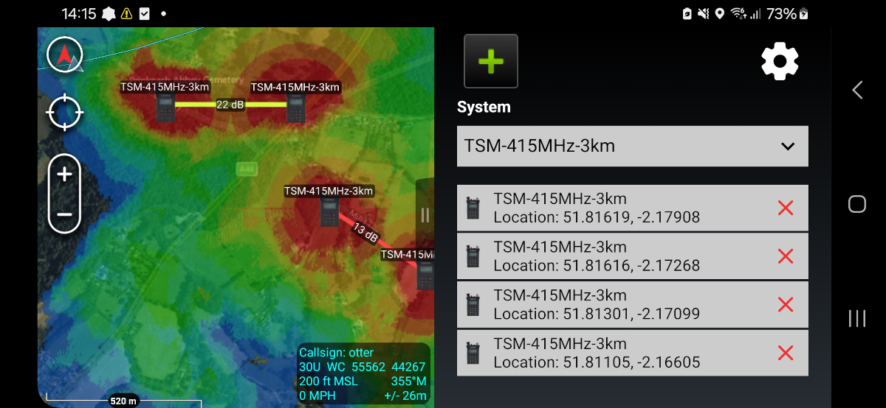
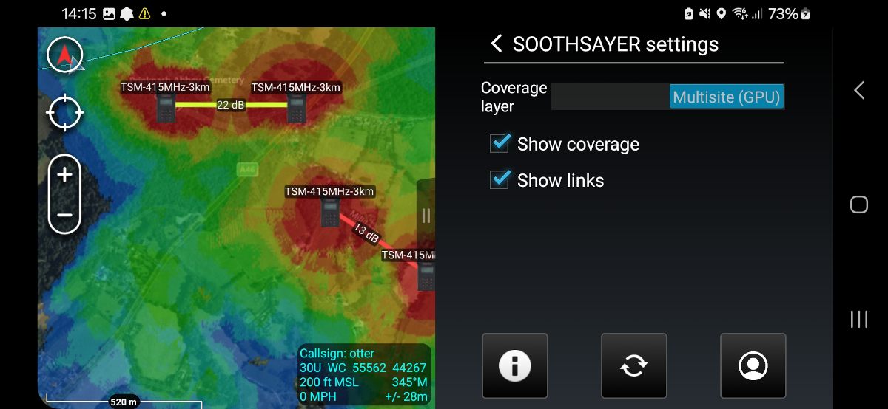
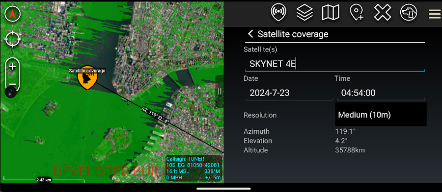

# SOOTHSAYER ATAK Plugin

This plugin is a tactical client to the CloudRF / SOOTHSAYER [radio planning API](https://cloudrf.com/documentation/developer/). 

Presently, users can task the `Area`, `Multisite`, `Points` and `Satellite` APIs to make heatmaps and links for RF systems using planned and/or live positions.

# Latest release

The latest release (22nd July 2025) is 2.0 and is available [here](https://github.com/Cloud-RF/SOOTHSAYER-ATAK-plugin/releases).

This is the first release with the live feature which lets users select callsigns from the map to automatically generate coverage. 

## Points of Contact

- Issue board: https://github.com/Cloud-RF/SOOTHSAYER-ATAK-plugin
- Developer email: [support@cloudrf.com](mailto:support@cloudrf.com)

*This is a fully supported, genuine, privately funded, open source application by a small business, CloudRF.*

## Ports Required

Outgoing: TCP 443

## Equipment Required

- An Android phone running ATAK-CIV [available in the app store](https://play.google.com/store/apps/details?id=com.atakmap.app.civ)

- Either a [CloudRF account](https://cloudrf.com/my-account) or a SOOTHSAYER server

*For operation on a private network you will require a [SOOTHSAYER server](https://cloudrf.com/soothsayer) which can be deployed offline as OCI containers. The API is the same as CloudRF.*

## Equipment Supported

ATAK 5.x

## Documentation

To keep size manageable, our full documentation is online.

https://cloudrf.com/documentation/06_atak_plugin.html

You can find a concise text only guide within the app settings.

## Quickstart
You can find a ready made APK release under the [releases](https://github.com/Cloud-RF/SOOTHSAYER-ATAK-plugin/releases) section of the repository. Copy the .apk file to your phone and install it using ATAK's plugins menu.

To use the plugin, login to your account first. For CloudRF the service should be `https://cloudrf.com` and for a SOOTHSAYER server it should be your server's IP/FQDN eg. https://192.168.1.3 or https://soothsayer.company.com

Radio templates from your account will downloaded after you login. You may also side load templates as JSON files to your atak/SOOTHSAYER/templates folder on the SD card. These files can be downloaded from the CloudRF web interface or from the [public template repository](https://github.com/Cloud-RF/CloudRF-API-clients/tree/master/templates).

To simulate coverage and layers click the SOOTHSAYER icon to add a marker to the map and then either click the play button or drag the marker to trigger a calculation. For more information see the [user documentation](https://cloudrf.com/documentation/06_atak_plugin.html).

### Co-opt feature (Live mapping)
Added in 2.0, this powerful feature allows any radio, marker or callsign to be assigned a template and its coverage mapped in real time using GPS data. You can see live coverage for a moving radio network, and fix gaps with live planning. By using ATAK as the API, this allows proprietary systems to be used together without requiring a plugin for each.

For systems on the ground, the template altitude will be used. For systems with an altitude 100m above the ground like aircraft, the transmitter altitude will be set to AMSL and the receiver altitude will be set to the ground height.

The radio map will refresh on a fixed interval or when it moves a certain distance. Both these values are defined within the settings.

### Output bounds
Instead of generating and then filling up the display with big circular heatmaps, you can focus effort onto a distant objective using the polygon tool. Not only will this speed up calculations significantly, it will save device memory and avoid cluttering up the display.
Used selectively, this can make CPU calculations as fast as a standard GPU "circle".

### Satellite coverage

Added in 1.4, this feature uses the new [Satellite API](https://cloudrf.com/documentation/developer/#/Satellite/satellite%2Farea) to test a wide area for satellite visibility. 

To use it, **ensure you have coverage enabled** in the plugin options and then enter the name of a satellite eg. OPTUS C1. Select a date/time and then drag the satellite marker to place it upon the earth. 

An area of 1 million points will be tested against the API. The radius is relative to the resolution so at 2m = 1km, 10m = 5km, 20m = 10km.

### Premium API features

Some CloudRF API features require a Silver or Gold account such as Multisite and Satellite coverage which uses a GPU. If you want to evaluate the plugin with a free or Bronze account, slide the mode slider to `Single (CPU)` which will perform a slower single-site CPU calculation.
*A private server has no restrictions.*
