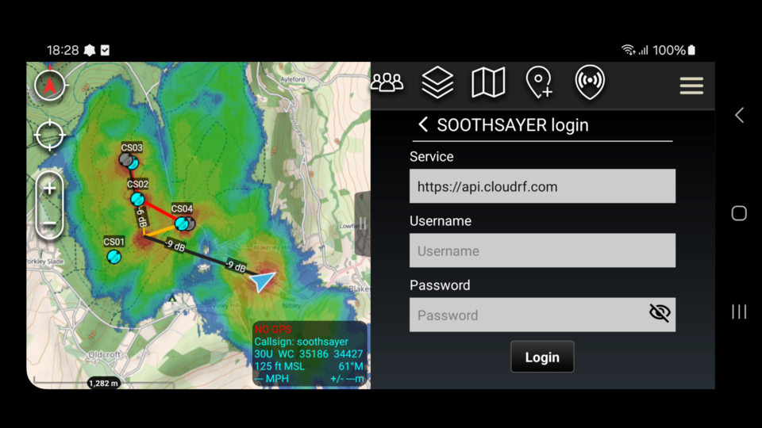

# SOOTHSAYER ATAK Plugin

This plugin is a client to the CloudRF / SOOTHSAYER [radio planning API](https://cloudrf.com/documentation/developer/). 

Users can task the `Area`, `Multisite`, `Points` and `Satellite` APIs to plan future communications deployments as well as **visualise live coverage** for moving callsigns.

# Latest release

The **latest signed release is 2.5.3** (23rd December 2025), built for ATAK 5.6, is available to download [here](https://github.com/Cloud-RF/SOOTHSAYER-ATAK-plugin/releases).

## Points of Contact

- Issue board: https://github.com/Cloud-RF/SOOTHSAYER-ATAK-plugin
- Developer email: [support@cloudrf.com](mailto:support@cloudrf.com)

*This is a fully supported, genuine, privately funded, open source application by a UK small business. It's open source so others can benefit from it and you're free to take code from our plugin to use in your own.*

## Ports Required

Outgoing: TCP 443

## Equipment Required

- An Android phone/tablet running ATAK 5.x ([app store](https://play.google.com/store/apps/details?id=com.atakmap.app.civ))

- A [CloudRF account](https://cloudrf.com/my-account) OR a private SOOTHSAYER&trade; server

*For operation on a private network you require a [SOOTHSAYER server](https://cloudrf.com/soothsayer) which can be deployed offline as containers.*

## Documentation

The user documentation is online and available as a PDF at https://cloudrf.com/documentation/06_atak_plugin.html

You can find a concise text guide within the app's settings.

## Quickstart
You can find a ready made APK release [here](https://github.com/Cloud-RF/SOOTHSAYER-ATAK-plugin/releases). Copy the .apk file to your phone and install it using ATAK's plugin manager.

To use the plugin, login to your account: For CloudRF the service is `https://api.cloudrf.com` and for a SOOTHSAYER server it should be your server's IP eg. https://192.168.1.3

Radio templates from your account will fetched after you login. You may also side load templates as JSON files to your atak/SOOTHSAYER/templates folder on the SD card. These .json files can be downloaded from the CloudRF web interface or our [public template repository](https://github.com/Cloud-RF/CloudRF-API-clients/tree/master/templates).

To simulate coverage and layers click the SOOTHSAYER icon to add a marker to the map and then either click the play button or drag the marker to trigger a calculation. For more information see the [user documentation](https://cloudrf.com/documentation/06_atak_plugin.html).

## Co-opt feature (Live coverage)
Added in 2.0, this powerful feature allows any radio, marker or callsign to be assigned a template and its coverage mapped in real time using GPS data. You can see live coverage for a moving radio network, and fix gaps with live planning. By using ATAK as the API, this allows proprietary systems to be used together without requiring a plugin for each.

For systems on the ground, the template altitude will be used. For systems with an altitude 100m above the ground like aircraft, the transmitter altitude will be set to AMSL and the receiver altitude will be set to the ground height.

The radio map will refresh on a fixed interval or when it moves a certain distance. Both these values are defined within the settings.

### Polygon bounds
You can focus effort efficiently onto a distant objective using the polygon tool. Not only will this speed up calculations significantly, it will sharpen the resolution, save device memory and avoid cluttering up the display. Used selectively, this can make CPU calculations as fast as a standard GPU "circle".

### Satellite coverage

Added in 1.4, this feature uses the [Satellite API](https://cloudrf.com/documentation/developer/#/Satellite/satellite%2Farea) to test a wide area for satellite visibility. 

To use it, **ensure you have coverage enabled** in the plugin options and then enter the name of a satellite eg. OPTUS C1. Select a date/time and then drag the satellite marker to place it upon the earth. An area of 1 million points will be tested against the API. The radius is relative to the resolution so at 2m = 1km, 10m = 5km, 20m = 10km.

### Premium API features

Some features require a premium CloudRF account such as Multisite which uses a powerful GPU. If you want to evaluate the plugin with a free or Bronze account, slide the mode slider to `Single (CPU)` which will perform a slower single-site CPU calculation. Alternatively ask us nicely for a coupon :)

*A private server has no feature restrictions as you pay for the electricity!*
